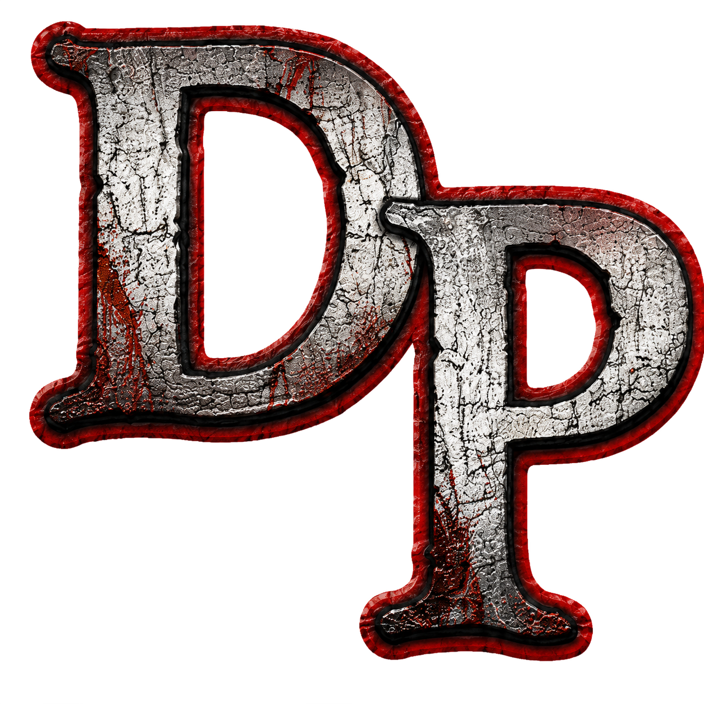

<div align="center">



# DP1 Launcher

**Modern fan-made launcher for _Deadly Premonition: The Director's Cut_**
<br>
_Сучасний фанатський лаунчер для_ **Deadly Premonition: The Director's Cut**

[](https://github.com/LittleBitUA/DP1-Launcher/releases)
[](LICENSE)
[](https://t.me/LittleBitUA)

</div>

---

## 🇺🇦 Українською

Одне натискання LAUNCH замість години ритуалу з DPfix, патчем 4GB та DXVK.
Лаунчер сам завантажує, встановлює й налаштовує все необхідне.

### Можливості

- 🎮 **Запуск гри через Steam** одним кліком (`steam://run/247660`)
- 🔧 **Автоматична настройка** — DPFix v0.9.5, 4GB LAA Patch, DXVK 2.7.1 ставляться під час першого запуску
- 🔍 **Авто-пошук гри у Steam-бібліотеках** (registry + парсинг `libraryfolders.vdf`)
- 🎨 **Liquid-glass UI** — темний кінематографічний інтерфейс із червоними акцентами, атмосфера Greenvale
- ⚙️ **Редагування DPfix.ini** — AA, тіні, SSAO, DoF, роздільна здатність, режим екрана, частота
- 💾 **Автоматичні бекапи збережень** кожні 2 хвилини + швидке відновлення в один клік
- 🪟 **Режим сумісності Windows** — XP SP3 або Windows 98 / Me через реєстр
- 📰 **GitHub-стрічка новин** — лаунчер тягне `news.json` із цього репо
- 🔔 **Перевірка оновлень** через GitHub Releases API
- 🇺🇦🇬🇧 **Дві мови** — українська та англійська

### Що використовується

| Компонент       | Автор                            | Призначення                                   |
|-----------------|----------------------------------|-----------------------------------------------|
| **DPFix v0.9.5**| Peter «Durante» Thoman           | Графічний фіксер для гри                       |
| **4GB Patch**   | NTCore (Daniel Pistelli)         | Зняття обмеження 2 ГБ ОЗП                      |
| **DXVK 2.7.1**  | Philip «doitsujin» Rebohle       | Vulkan-рендерер для D3D9                       |

### Встановлення

1. Завантажте останню версію з [Releases](https://github.com/LittleBitUA/DP1-Launcher/releases)
2. Розпакуйте архів у будь-яку папку
3. Запустіть `DP1 Launcher.exe`
4. Лаунчер сам знайде гру у Steam і запропонує встановити компоненти

> **Вимоги:** Windows 10 (1803+) або Windows 11, інстальована гра в Steam.

### Розробка

```bash
npm install
npm start              # запуск у dev-режимі
npm run pack           # портативний білд (electron-packager)
```

Стек: **Electron** (vanilla JS, без React/фреймворків), worker-threads для INI-I/O,
вбудований Windows `tar.exe` для розпакування `.tar.gz`, PowerShell для роботи з реєстром.

---

## 🇬🇧 In English

One LAUNCH click instead of an hour-long ritual with DPfix, 4GB Patch and DXVK.
The launcher downloads, installs and configures everything for you.

### Features

- 🎮 **Steam launch** in one click (`steam://run/247660`)
- 🔧 **Auto-setup** — DPFix v0.9.5, 4GB LAA Patch, DXVK 2.7.1 are installed on first run
- 🔍 **Steam library autodetect** (registry + `libraryfolders.vdf` parsing)
- 🎨 **Liquid-glass UI** — dark cinematic interface, red accents, Greenvale vibe
- ⚙️ **DPfix.ini editor** — AA, shadows, SSAO, DoF, resolution, display mode, refresh rate
- 💾 **Save backups every 2 minutes** + one-click restore with confirm dialog
- 🪟 **Windows compatibility** — XP SP3 or Windows 98 / Me via registry
- 📰 **GitHub news feed** — fetched from `news.json` in this repo
- 🔔 **Update notifications** via GitHub Releases API
- 🇺🇦🇬🇧 **Two languages** — Ukrainian and English

### Components used

| Component        | Author                           | Purpose                                       |
|------------------|----------------------------------|-----------------------------------------------|
| **DPFix v0.9.5** | Peter "Durante" Thoman           | Graphical fixer for the game                  |
| **4GB Patch**    | NTCore (Daniel Pistelli)         | Removes the 2 GB RAM ceiling                  |
| **DXVK 2.7.1**   | Philip "doitsujin" Rebohle       | Vulkan renderer for D3D9                      |

### Installation

1. Download the latest version from [Releases](https://github.com/LittleBitUA/DP1-Launcher/releases)
2. Extract the archive anywhere
3. Run `DP1 Launcher.exe`
4. The launcher autodetects the game in your Steam libraries and offers to install the patches

> **Requirements:** Windows 10 (1803+) or Windows 11, the game installed via Steam.

### Development

```bash
npm install
npm start              # dev mode
npm run pack           # portable build (electron-packager)
```

Stack: **Electron** (vanilla JS, no React/frameworks), worker-threads for INI I/O,
Windows-built-in `tar.exe` for `.tar.gz` extraction, PowerShell for registry ops.

---

## ⚖️ Disclaimer

Цей проєкт не афілійований із Access Games / Rising Star Games / Toybox Inc.
Усі права на гру належать правовласникам. Це — фанатська ініціатива, безкоштовно
і з відкритою душею.

This project is not affiliated with Access Games / Rising Star Games / Toybox Inc.
All rights to the game belong to their respective owners. This is a fan-made,
free, open initiative.

---

<div align="center">

Створено **Dmytro Bidlov** з любов'ю від [«Little Bit»](https://t.me/LittleBitUA) 🇺🇦
&nbsp;·&nbsp;
Made by **Dmytro Bidlov** with love from [«Little Bit»](https://t.me/LittleBitUA) 🇺🇦

Спасибі Swery (Hidetaka Suehiro) за безсмертну, абсурдну й щемливу гру. ✦

</div>
